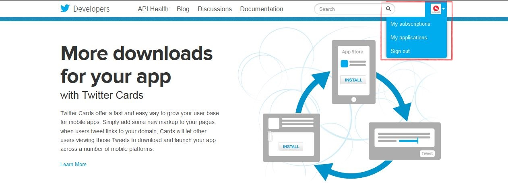
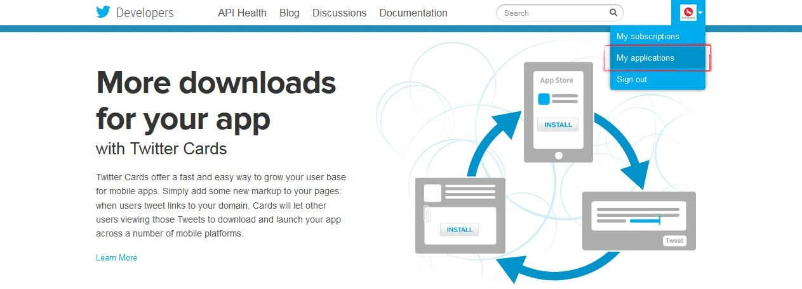
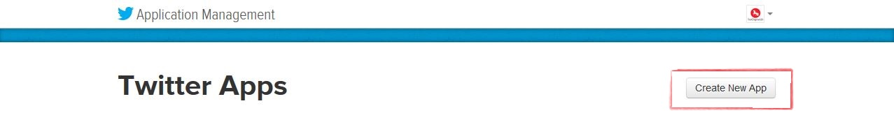
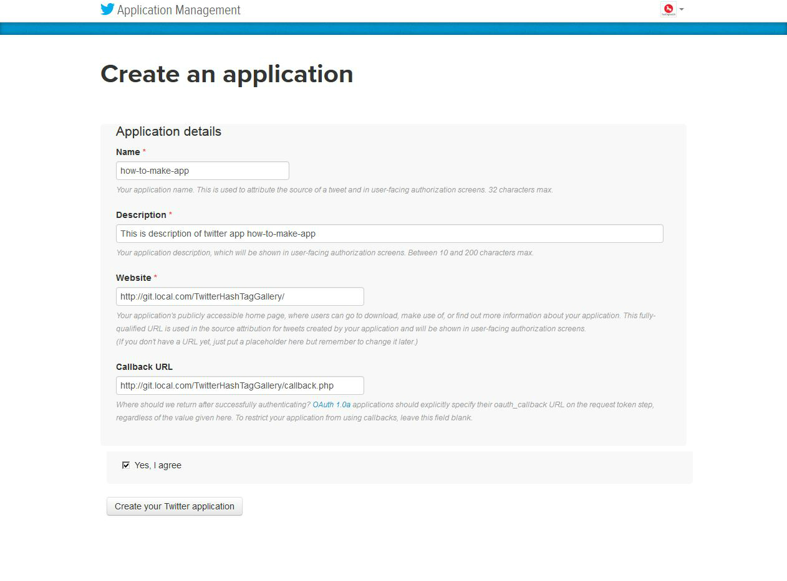
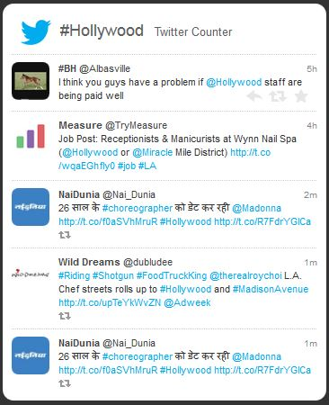

# TwitterHashTagGallery v1.0 BETA

TwitterHashTagGallery is a jQuery plugin designed to retrieve Twitter hashtags and references using jQuery and PHP. Originally created by Tom ([WebDevDoor](http://www.webdevdoor.com/javascript-ajax/custom-twitter-feed-integration-jquery/)), this version is an adaptation of the original script, updated with new features and packaged as a jQuery plugin.

## Requirements

To run TwitterHashTagGallery, you'll need:

- Twitter OAuth
- Twitter Library for PHP
- Twitter App credentials

## Getting Started

If you're new to creating a Twitter App, follow these steps:

1. **Create a Twitter App:**
   - Log in to the [Twitter Developer site](http://dev.twitter.com/) with your Twitter credentials.

   

   

   

   

   

   

2. **Configuration:**
   - Once your Twitter App is created, obtain the necessary tokens and keys and update the `config.php` settings accordingly.

3. **TwitterHashTagGallery Script Settings:**
   - TwitterHashTagGallery offers customizable settings to tailor the user experience. Modify the `config` object in your JavaScript file as needed.

### Example Configuration (config.js):

```javascript
var config = {
	// Enter the hashtag to fetch tweets
	setHashTags : '#Fifa',
	// Enter the user reference to fetch tweets
	setUserReferences : '@Fifa',
	// Define the number of tweets to retrieve
	twitterLimitCount : 4,
	// Optional: Twitter profile name
	twitterProfileName : "Scott",
	// Optional: Twitter screen name
	twitterScreenName : "Scott",
	// Show direct tweets
	showDirectTweets : true,
	// Show retweets
	showReTweets : true,
	// Show tweet links
	showTweetLinks : true,
	// Show user profile pictures
	showProfilePics : true,
	// Show tweet actions (e.g., retweet, share)
	showTweetActions : true,
	// Show retweet indicator
	showReTweetIndicator : true,
	// Show loader
	showLoader : true,
	// Show header
	showHeader : true,
	// Set loading GIF image
	loadingGIF : 'images/ajax-loader.gif',
	// Enable auto-update
	autoUpdate : false,
	// Set time interval in milliseconds (e.g., 10000 = 10 seconds)
	intervalTime : 10000
}
```

## TwitterHashTagGallery Preview



---
